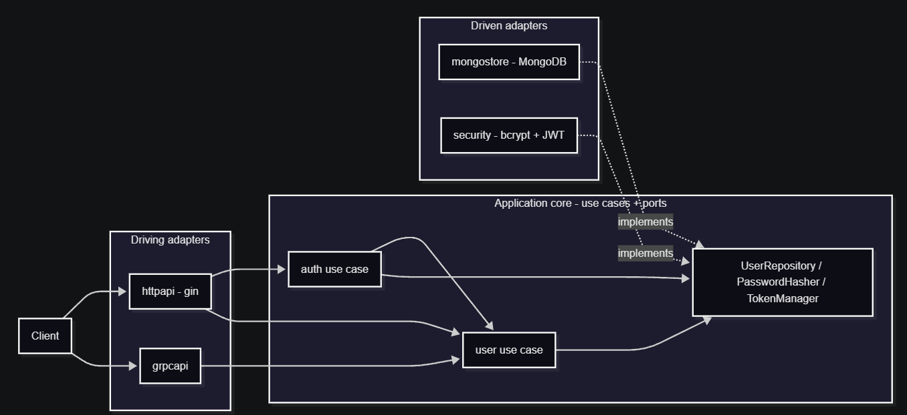

# ThaiMart — User Management API

[](https://github.com/minearithmeticop/thaimart-backend-challenge/actions/workflows/ci.yml)
[](https://github.com/minearithmeticop/thaimart-backend-challenge/actions/workflows/ci.yml)

Backend coding challenge: a RESTful user management API in Go with gin,
MongoDB persistence and JWT authentication — plus a gRPC surface — built
on a hexagonal (ports & adapters) structure.

Part 2 of the challenge, the Lottery Search System, is delivered as a
design document: [docs/lottery-design.md](docs/lottery-design.md).

## Architecture

Dependencies point inwards: transports and storage are adapters around
a framework-free core. Both HTTP and gRPC reuse the same use cases,
validation and JWT verification.



```text
cmd/api            entrypoint: config → adapters → serve HTTP + gRPC
internal/domain    entities + sentinel errors (no framework imports)
internal/app       use cases + ports
  ├─ auth          register, login
  ├─ user          CRUD + input validation
  └─ report        background user-count reporter
internal/platform  adapters
  ├─ httpapi       gin routes, middleware, DTOs, error mapping
  ├─ grpcapi       gRPC server, auth interceptor
  ├─ mongostore    UserRepository on MongoDB + unique email index
  └─ security      bcrypt hasher + HS256 JWT manager
api/proto          user.v1 contract + generated code
deploy             compose stack (api + mongo, optional mongo-express)
```

## Run locally

### Everything in one command (Docker)

```shell
docker compose -f deploy/compose.yaml up -d --build
docker compose -f deploy/compose.yaml ps     # wait until thaimart-api is healthy
curl http://localhost:8080/healthz
```

This brings up the API (HTTP `:8080`, gRPC `:50051`) and MongoDB
together. Tear down with `docker compose -f deploy/compose.yaml down`
(add `-v` to wipe the data volume too).

### From source (development loop)

Prerequisites: Go 1.26+, Docker.

```shell
# 1. Start MongoDB only and wait until it reports healthy
docker compose -f deploy/compose.yaml up -d mongo
docker compose -f deploy/compose.yaml ps

# 2. Run the API (connects to MongoDB, serves /healthz)
go run ./cmd/api

# 3. Smoke test — returns {"status":"ok"} when MongoDB is reachable
curl http://localhost:8080/healthz
```

Configuration via environment variables (all optional, defaults shown):

| Variable        | Default                     | Purpose                               |
| --------------- | --------------------------- | ------------------------------------- |
| `HTTP_ADDR`     | `:8080`                     | HTTP listen address                   |
| `GRPC_ADDR`     | `:50051`                    | gRPC listen address                   |
| `MONGO_URI`     | `mongodb://localhost:27017` | MongoDB connection URI                |
| `MONGO_DB`      | `thaimart`                  | MongoDB database name                 |
| `JWT_SECRET`    | auto-generated              | HS256 signing key; set in production  |
| `JWT_TTL`       | `1h`                        | Token lifetime                        |
| `BCRYPT_COST`   | `10`                        | bcrypt cost factor (4–15)             |
| `LOG_FORMAT`    | `text`                      | `text` or `json`                      |
| `REPORT_EVERY`  | `10s`                       | User-count report interval            |

Tear down:

```shell
docker compose -f deploy/compose.yaml down        # keep data
docker compose -f deploy/compose.yaml down -v     # wipe data volume too
```

## Quick start

With the stack running (either way above):

```shell
# Register (public)
curl -s -X POST http://localhost:8080/api/v1/auth/register -H "Content-Type: application/json" -d "{\"name\":\"Somchai\",\"email\":\"somchai@example.com\",\"password\":\"P@ssw0rd1\"}"

# Login — returns a bearer token (public)
curl -s -X POST http://localhost:8080/api/v1/auth/login -H "Content-Type: application/json" -d "{\"email\":\"somchai@example.com\",\"password\":\"P@ssw0rd1\"}"

# Use the token on a protected route (paste the token from the login response)
set TOKEN=<your-token>
curl -s http://localhost:8080/api/v1/users -H "Authorization: Bearer %TOKEN%"
```

## API reference

All bodies are JSON. Public routes: `POST /api/v1/auth/register`,
`POST /api/v1/auth/login`, `GET /healthz`. Everything else requires
`Authorization: Bearer <token>`.

### Register — `POST /api/v1/auth/register` (public)

```shell
curl -s -X POST http://localhost:8080/api/v1/auth/register -H "Content-Type: application/json" -d "{\"name\":\"Somchai\",\"email\":\"somchai@example.com\",\"password\":\"P@ssw0rd1\"}"
```

```json
{
  "id": "6a899e8ae73821a0d077c838",
  "name": "Somchai",
  "email": "somchai@example.com",
  "created_at": "2026-08-22T13:05:14.735Z"
}
```

`201 Created` with a `Location: /api/v1/users/{id}` header. The
password is hashed with bcrypt before storage and never appears in any
response. A duplicate email returns `409`.

### Login — `POST /api/v1/auth/login` (public)

```shell
curl -s -X POST http://localhost:8080/api/v1/auth/login -H "Content-Type: application/json" -d "{\"email\":\"somchai@example.com\",\"password\":\"P@ssw0rd1\"}"
```

```json
{
  "token": "eyJhbGciOiJIUzI1NiIsInR5cCI6IkpXVCJ9...",
  "token_type": "Bearer",
  "expires_at": "2026-08-22T14:05:14Z",
  "user": {
    "id": "6a899e8ae73821a0d077c838",
    "name": "Somchai",
    "email": "somchai@example.com",
    "created_at": "2026-08-22T13:05:14.735Z"
  }
}
```

Wrong email and wrong password return the same `401` — the endpoint
cannot be used to probe which addresses are registered.

### Create user — `POST /api/v1/users` (JWT)

Same body as register; returns `201` with the created user.

### List users — `GET /api/v1/users?limit=&offset=` (JWT)

```shell
curl -s "http://localhost:8080/api/v1/users?limit=2&offset=0" -H "Authorization: Bearer %TOKEN%"
```

```json
{
  "users": [
    { "id": "6a899e8ae73821a0d077c838", "name": "Somchai", "email": "somchai@example.com", "created_at": "2026-08-22T13:05:14.735Z" },
    { "id": "6a899e99e73821a0d077c839", "name": "Somsri", "email": "somsri@example.com", "created_at": "2026-08-22T13:05:29.284Z" }
  ],
  "total": 5,
  "limit": 2,
  "offset": 0
}
```

Oldest first. `limit` defaults to 20 and is capped at 100.

### Get user — `GET /api/v1/users/{id}` (JWT)

Returns the user object above; `404` when the id does not exist and
`400` when it is not a 24-character hex id.

### Update user — `PATCH /api/v1/users/{id}` (JWT)

Partial update — include only the fields to change:

```shell
curl -s -X PATCH http://localhost:8080/api/v1/users/6a899e8ae73821a0d077c838 -H "Authorization: Bearer %TOKEN%" -H "Content-Type: application/json" -d "{\"name\":\"Somchai Jaidee\"}"
```

Returns `200` with the updated user. Changing to an email that is
already taken returns `409`; sending no fields at all returns `400`.

### Delete user — `DELETE /api/v1/users/{id}` (JWT)

Returns `204 No Content`; deleting again returns `404`.

### Status codes

| Status | Meaning                                                  |
| ------ | -------------------------------------------------------- |
| 400    | Invalid input: validation, malformed JSON or user id     |
| 401    | Missing/invalid/expired token; wrong email or password   |
| 404    | No user with the given id                                |
| 409    | Email already registered                                 |
| 500    | Unexpected failure (cause is logged, never returned)     |
| 503    | `/healthz` only: MongoDB unreachable                     |

## JWT guide

Tokens are HS256-signed JWTs. There is exactly one way to obtain one:
`POST /api/v1/auth/login` (registration does not return a token — the
spec separates registration from authentication).

A login token decodes to:

```json
{
  "sub": "6a899e8ae73821a0d077c838",
  "email": "somchai@example.com",
  "iss": "thaimart-user-api",
  "iat": 1787403915,
  "exp": 1787407515
}
```

Using it:

- HTTP: `Authorization: Bearer <token>` on any protected route.
- gRPC: the same value as `authorization` metadata — see the
  [grpcurl](#grpc-surface) examples; a token issued by HTTP login works
  over gRPC unchanged because both transports verify through one
  `TokenManager`.

Lifetime is `JWT_TTL` (default 1h); the login response includes
`expires_at`. Expired or tampered tokens return `401`. Verification
pins the algorithm to HS256, so headers claiming `none` or an RS-family
algorithm are rejected (the alg-confusion attack).

The signing key is `JWT_SECRET`. If unset, the service generates an
ephemeral random key at boot and logs a warning — convenient for
development, but tokens die on every restart; the compose stack sets a
stable development value. Set a real secret in production. Tokens are
stateless: there is no server-side session or revocation list, which is
why the TTL is kept short.

## gRPC surface

The same process also serves gRPC (default `:50051`, `GRPC_ADDR`),
exposing `user.v1.UserService` with `CreateUser` and `GetUser`.
Authentication uses the same JWTs as HTTP, passed as
`authorization: Bearer <token>` metadata and enforced by a unary
interceptor. Server reflection is enabled, so
[grpcurl](https://github.com/fullstorydev/grpcurl) works without proto
files:

```shell
set TOKEN=<your-token>
grpcurl -plaintext -H "authorization: Bearer %TOKEN%" -d "{\"name\":\"gRPC User\",\"email\":\"grpc@example.com\",\"password\":\"P@ssw0rd1\"}" localhost:50051 user.v1.UserService/CreateUser
grpcurl -plaintext -H "authorization: Bearer %TOKEN%" -d "{\"id\":\"<user-id>\"}" localhost:50051 user.v1.UserService/GetUser
```

The proto definition lives in `api/proto/user/v1/user.proto`; regenerate
the Go code after editing it with `buf generate api/proto` (see
`buf.gen.yaml`).

## Testing

```shell
go test ./...          # unit tests run anywhere; Mongo tests skip if unreachable
go test ./... -race    # what CI runs
```

The core (domain + use cases) is unit-tested against in-memory fakes at
the ports — no database required. The MongoDB adapter has integration
tests against a real database (skipped automatically when none is
reachable, run against a service container in CI). The gRPC adapter is
tested over an in-memory bufconn listener, and a dedicated CI job
builds the Docker image and smoke-tests the whole stack over live HTTP.

## Browse the data with mongo-express (optional)

mongo-express is a web UI for MongoDB. It is not started by default; add
the `tools` profile when you want it:

```shell
docker compose -f deploy/compose.yaml --profile tools up -d
```

Then open <http://localhost:8081> and sign in with:

- Username: `admin`
- Password: `P@assw0rd1`

The API database is `thaimart` (collection `users`). Test leftovers live
in `thaimart_test_*` databases. To stop everything again, use the tear
down commands above.

## Assumptions & design decisions

1. **Hexagonal architecture.** Domain and use cases import no framework
   or driver; transports (gin, gRPC) and storage (MongoDB) are adapters
   behind ports. This is what let a second transport (gRPC) reuse
   validation, business rules and JWT verification without duplicating
   a line, and what lets tests swap MongoDB for in-memory fakes.
2. **Validation lives in the use cases.** One rule set (required fields,
   email format, lengths, minimum password) serves both transports.
   gin's `binding` tags were deliberately not used: a second rule set at
   the transport would drift out of sync, and gRPC would bypass it.
3. **JWT with HS256 and the algorithm pinned.** Verification refuses any
   other algorithm, blocking the alg-confusion attack. The development
   fallback is an ephemeral per-boot secret with a loud warning. When
   more services need to verify tokens, switch to RS256 so verifiers
   hold only a public key instead of a signing secret.
4. **Errors speak the domain language inside and the protocol at the
   edge.** Use cases return sentinel errors (`ErrEmailAlreadyExists`,
   ...); each transport maps them to status codes in exactly one place.
   Unexpected 500s log the cause but never return it to clients.
5. **Login cannot enumerate accounts.** Unknown email and wrong
   password produce the identical error and message.
6. **Email uniqueness has one source of truth: MongoDB's unique index.**
   The pre-insert lookup is a convenience that also avoids spending
   bcrypt CPU (~90ms/hash at cost 10) on doomed duplicates; a
   concurrent-create test proves exactly one winner under contention.
7. **Register is synchronous because the spec requires it.** Under
   nation-scale bursts the same command side would become event-driven:
   accept into a queue, answer `202 Accepted` immediately, confirm
   asynchronously (outbox pattern). The capacity math is dominated by
   bcrypt — roughly 11 hashes/s per core at cost 10.
8. **Right-sized on purpose.** One service, no Redis/Kafka/microservice
   split: nothing in the requirements needs them. The hexagonal boundary
   keeps that split a future refactor rather than a rewrite.
9. **The background count job degrades gracefully.** It reports
   immediately at boot and then every `REPORT_EVERY`; a failing database
   logs a warning and retries on the next tick instead of crashing; it
   stops with the graceful shutdown.
10. **Configuration fails fast.** Every knob is validated at boot
    (ranges, formats, positivity) — a typo kills startup instead of
    surfacing as wrong behavior mid-flight.
11. **The Docker image is a runtime, not a toolbox.** Multi-stage build
    with a static binary, unprivileged user, CA certificates and tzdata,
    and a `/healthz`-based HEALTHCHECK that compose and CI wait on.
